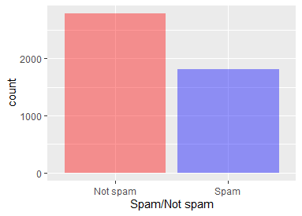
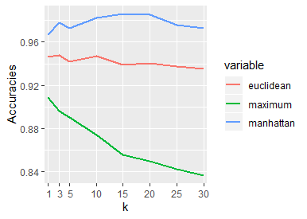
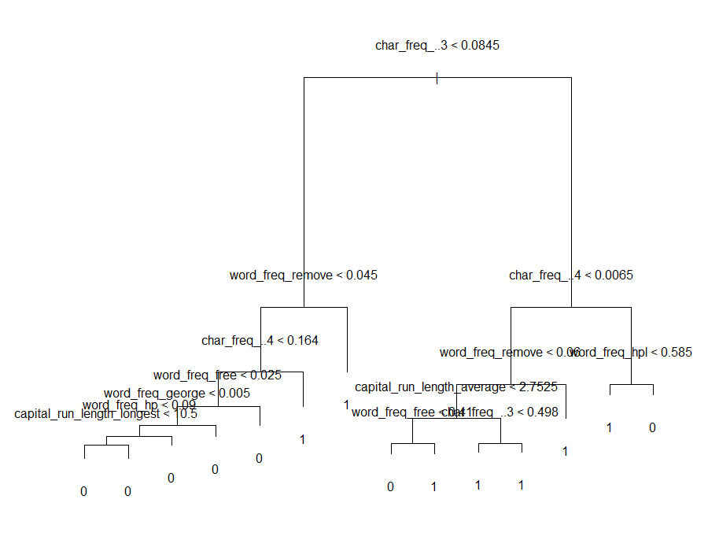

# Spam e-mail classification

This project considers the data set of e-mails and variations of the kNN algorithm, tries to successfully classify the e-mails as spam or not spam. Furthermore, classification tree and naive bayes algorithms were tried out.  

## Prerequisites 
* KODAMA v0.0.1
* tree
* reshape
* caret
* ggplot2
* e1071
## Data set

The data set available on https://archive.ics.uci.edu/ml/datasets/spambase contains information about 4601 e-mails. Each e-mail is described with 57 attributes and contains 1 class attribute that signalizes whether the e-mail is spam or not. In the data set 60.6% of e-mails are not spam. Different versions of kNN algorithm, as well as classification tree and naive bayes were used to classify the data. 

## Methods

* kNN - different variation of the kNN algorithm were tryed out. Various distance metrics and values for k were used to obtain the best result.
* Classification tree
* Naive Bayes 

 

## Results

* kNN - best result of 98.62% was obtained for k = 1 using the Manhate
* Classification tree - 88.92%
* Naive Bayes - 70.23%

